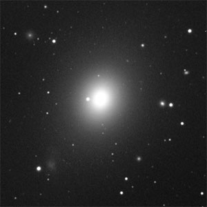

# Астрофизика

## Гравитационное красное смещение (Z)

Является проявлением эффекта изменения частоты испущенного некоторым источником света (вообще говоря, любых электромагнитных волн) по мере удаления от массивных объектов, таких как звёзды и чёрные дыры. Оно наблюдается как сдвиг спектральных линий в излучении источников, близких к массивным телам, в красную область спектра.

## Эффект Доплера

Изменение частоты и, соответственно, длины волны излучения, воспринимаемое наблюдателем, вследствие движения источника излучения и/или движения наблюдателя.

## Взрыв сверхновой

Феномен, в ходе которого звезда резко увеличивает свою яркость на 4—8 порядков с последующим сравнительно медленным затуханием вспышки. Является результатом катаклизмического процесса, возникающего в конце эволюции некоторых звёзд и сопровождающегося выделением огромной энергии.

## Гало галактики

Невидимый компонент галактики, основная часть её сферической подсистемы. Гало имеет сферическую форму и простирается за видимую часть галактики. В основном состоит из разрежённого горячего газа, звёзд и тёмной материи, составляющей основную массу галактики.

## Пульсар

Космический источник радио (радиопульсар), оптического (оптический пульсар), рентгеновского (рентгеновский пульсар) и/или гамма- (гамма-пульсар) излучений, приходящих на Землю в виде периодических всплесков (импульсов). Согласно доминирующей астрофизической модели, пульсары представляют собой вращающиеся нейтронные звёзды с магнитным полем, которое наклонено к оси вращения, что вызывает модуляцию приходящего на Землю излучения.

## Квазар

Квазары представляют собой активные ядра галактик на начальном этапе развития, в которых сверхмассивная чёрная дыра поглощает окружающее вещество, формируя аккреционный диск. Он и является источником излучения, исключительно мощного (иногда в десятки и сотни раз превышающего суммарную мощность всех звёзд таких галактик, как наша) и имеющего помимо космологического гравитационное красное смещение, предсказанное А. Эйнштейном в общей теории относительности (ОТО).

## Черная дыра

Область пространства-времени, гравитационное притяжение которой настолько велико, что покинуть её не могут даже объекты, движущиеся со скоростью света, в том числе кванты самого света. Граница этой области называется горизонтом событий, а её характерный размер — гравитационным радиусом. В простейшем случае сферически симметричной чёрной дыры он равен радиусу Шварцшильда.

## Нейтронная звезда

Космическое тело, являющееся одним из возможных результатов эволюции звёзд, состоящее, в основном, из нейтронной сердцевины, покрытой сравнительно тонкой (∼1 км) корой вещества в виде тяжёлых атомных ядер и электронов. Массы нейтронных звёзд сравнимы с массой Солнца, но типичный радиус нейтронной звезды составляет лишь 10—20 километров. Поэтому средняя плотность вещества такого объекта в несколько раз превышает плотность атомного ядра (которая для тяжёлых ядер составляет в среднем 2,8·1017 кг/м³). Дальнейшему гравитационному сжатию нейтронной звезды препятствует давление ядерной материи, возникающее за счёт взаимодействия нейтронов.

Многие нейтронные звёзды обладают чрезвычайно высокой скоростью вращения, — до нескольких сотен оборотов в секунду. Нейтронные звёзды возникают в результате вспышек сверхновых звёзд.

## Экзопланета

Планета, находящаяся вне Солнечной системы. Долгое время задача обнаружения планет возле других звёзд была неразрешимой, так как планеты чрезвычайно малы и тусклы по сравнению со звёздами, а сами звёзды находятся далеко от Солнца (ближайшая — на расстоянии 4,24 световых года).

### Методы поиска экзопланет

1. Метод Доплера — спектрометрическое измерение радиальной скорости звезды. Самый распространённый метод. Позволяет обнаружить планеты с массой не меньше нескольких масс Земли, расположенные в непосредственной близости от звезды, и планеты-гиганты с периодами до примерно 10 лет. Планета, обращаясь вокруг звезды, как бы раскачивает её, и мы можем наблюдать доплеровское смещение спектра звезды.

2. Транзитный метод — метод, основанный на наблюдении уменьшения светимость звезды при прохождении планеты на её фоне. Позволяет определить размеры планеты, а в сочетании с методом Доплера — плотность планеты. Даёт информацию о наличии атмосферы и её составе. Следует понимать, что этим методом можно обнаружить лишь те планеты, орбита которых лежит в одной плоскости с точкой наблюдения.

3. Метод гравитационного микролинзирования. Между наблюдаемым объектом (звездой, галактикой) и наблюдателем на Земле должна быть другая звезда, выступающая в роли линзы и фокусирующая своим гравитационным полем свет наблюдаемой звёздной системы. Если у звезды-линзы есть планеты, то появляется асимметричная кривая блеска, и, возможно, отсутствие ахроматичности. У этого метода крайне ограниченное применение. Метод чувствителен к планетам с малой массой, вплоть до земной.

4. Астрометрический метод — метод, основанный на изменении собственного движения звезды под гравитационным воздействием планеты. С помощью астрометрии были уточнены массы некоторых экзопланет, в частности, Эпсилона Эридана b.

5. Радионаблюдение пульсаров. Если вокруг пульсара вращаются планеты, то излучаемый пульсаром сигнал имеет осциллирующий характер. Мощные направленные пучки излучения пульсара образуют в пространстве конические поверхности. Если на такой поверхности окажется Земля, тогда возможно зарегистрировать данное излучение.

6. Метод прямого наблюдения — метод получения прямых изображений экзопланет посредством изолирования экзопланет от света их звезды.

## Двойная система

Система из двух гравитационно связанных звёзд, обращающихся по замкнутым орбитам вокруг общего центра масс. Двойные звёзды — весьма распространённые объекты. Примерно половина всех звёзд нашей Галактики принадлежит к двойным системам.

Измерив период обращения и расстояние между звёздами, иногда можно определить массы компонентов системы. Этот метод практически не требует дополнительных модельных предположений, и поэтому является одним из главных методов определения масс в астрофизике. По этой причине двойные системы, компонентами которых являются чёрные дыры или нейтронные звезды, представляют большой интерес для астрофизики.

## Компактный объект

Звезда, плотность которой многократно превышает плотность обычной звезды. К компактным объектам относятся:

1. белые карлики
2. нейтронные звёзды
3. чёрные дыры
4. экзотические звёзды (гипотетические).

## Металличность

Относительная концентрация элементов тяжелее гелия (их в астрономии принято называть металлами) в звёздах и галактиках. Является показателем возраста звёздной системы.

В первые минуты жизни Вселенной, в ней возникли водород (75 %), гелий (25 %), а также следы лития и бериллия. Образовавшиеся позднее первые звёзды, так называемые звёзды населения III, состояли только из этих элементов и практически не содержали металлов. Эти звёзды были чрезвычайно массивны, и в течение их жизни в них синтезировались элементы вплоть до железа. Затем звёзды погибали в результате взрыва сверхновых и синтезированные элементы распределялись по Вселенной. Пока ещё ни одной звезды этого типа не было найдено. Второе поколение звёзд (население II) родилось из материала звёзд первого поколения и имело довольно малую металличность. Каждое следующее поколение звёзд более богато металлами, чем предыдущее. Самые молодые звёзды, типа Солнца, которое является звездой третьего поколения (населения I), содержат самое высокое количество металлов.

## Астрономическая единица

Исторически сложившаяся единица измерения расстояний в астрономии. Исходно принималась равной большой полуоси орбиты Земли, которая в астрономии считается средним расстоянием от Земли до Солнца

## Собственное расстояние и сопутствующее расстояние

Две тесно связанные меры расстояния, применяемые в физической космологии для определения расстояний между объектами. Собственное расстояние примерно соответствует расстоянию до места, где удалённый объект был бы в определённый момент космологического времени, измеренному с помощью длинного ряда линеек, протянутых от нашей позиции до позиции объекта в это время, и меняющемуся с течением времени в связи с расширением Вселенной. Концепция сопутствующего расстояния «выносит за скобки» расширение Вселенной, позволяя использовать расстояние, которое не изменяется во времени из-за расширения пространства. Сопутствующее расстояние и собственное расстояние определяются таким образом, чтобы они были равны в настоящее время. Таким образом, эти два расстояния, вообще говоря, различны в любой момент времени, отличающийся от момента измерения: расширение Вселенной приводит к изменению собственного расстояния, в то время как сопутствующее расстояние при этом расширении не меняется.

## Угловое расстояние

Расстояние на небесной сфере между двумя небесными телами, измеренное по дуге большого круга, проходящего через них, с наблюдателем в центре.

## Угловой момент вращения

Характеризует количество вращательного движения. Величина, зависящая от того, сколько массы вращается, как она распределена относительно оси вращения и с какой скоростью происходит вращение.

## Галактика

Гравитационно-связанная система из звёзд и звёздных скоплений, межзвёздного газа и пыли, и тёмной материи. Все объекты в составе галактики участвуют в движении относительно общего центра масс.

Галактики — чрезвычайно далёкие астрономические объекты. Расстояние до ближайших из них измеряют в мегапарсеках, а до далёких — в единицах красного смещения z.

Галактики не имеют чётких границ. Нельзя точно сказать, где кончается галактика и начинается межгалактическое пространство. К примеру, если в оптическом диапазоне галактика имеет один размер, то определяемый по радионаблюдениям межзвёздного газа радиус галактики может оказаться в десятки раз больше. От размера зависит и измеряемая масса галактики.

### Морфология галактик

* Ядро — крайне малая область в центре галактики. Когда речь заходит о ядрах галактик, то чаще всего говорят об активных ядрах галактик, где процессы нельзя объяснить свойствами сконцентрированных в них звёзд.

* Диск — относительно тонкий слой, в котором сконцентрировано большинство объектов галактики. Подразделяется на газопылевой диск и звёздный диск.

* Полярное кольцо — редкий компонент. В классическом случае галактика с полярным кольцом имеет два диска, вращающихся в перпендикулярных плоскостях. Центры этих дисков в классическом случае совпадают. Причина возникновения полярных колец до конца не ясна[20].

* Сфероидальный компонент — сфероподобное распределение звёзд.

* Балдж (англ. bulge — вздутие) — наиболее яркая внутренняя часть сфероидального компонента.

* Гало — внешний сфероидальный компонент. Граница между балджем и гало размыта и достаточно условна.

* Спиральная ветвь (спиральный рукав) — уплотнение из межзвёздного газа и преимущественно молодых звёзд в виде спирали. Скорее всего, являются волнами плотности, вызванными различными причинами, однако вопрос об их происхождении до сих пор окончательно не решён.

* Бар (перемычка) — выглядит как плотное вытянутое образование, состоящее из звёзд и межзвёздного газа. По расчётам, главный поставщик межзвёздного газа к центру галактики.

### Классификация галактик

1. Эллиптические галактики (E) — галактики, у которых дисковой составляющей нет, либо она слабоконтрастна. Все остальные галактики дисковые.

2. Спиральные галактики (S) — галактики, обладающие спиральными ветвями. Иногда ветви могут вырождаться в кольца.

3. Линзовидные галактики (S0) — галактики, по своей структуре не отличающиеся от спиральных, за исключением отсутствия чёткого спирального узора. Объясняется это низким содержанием межзвёздного газа, а значит, и низким темпом звездообразования.

4. Неправильные галактики (Irr) — для них характерна неправильная клочковатая структура. Как правило, в них очень много межзвёздного газа, до 50% от массы галактики.

## Скопление галактик

Гравитационно-связанные системы галактик, одни из самых больших структур во Вселенной. Характерный размер по диаметру десятки миллионов световых лет.

## Аккреция

Процесс приращения массы небесного тела путём гравитационного притяжения материи (обычно газа) на него из окружающего пространства.

---

# Космология

## Состав вселенной

## Большой взрыв

По современным представлениям, наблюдаемая нами сейчас Вселенная возникла 13,77 ± 0,059 млрд лет назад из некоторого начального сингулярного состояния и с тех пор непрерывно расширяется и охлаждается. Согласно известным ограничениям по применимости современных физических теорий, наиболее ранним моментом, допускающим описание, считается момент Планковской эпохи с температурой примерно 1032 К (Планковская температура) и плотностью около 1093 г/см³ (Планковская плотность). Ранняя Вселенная представляла собой высокооднородную и изотропную среду с необычайно высокой плотностью энергии, температурой и давлением. В результате расширения и охлаждения во Вселенной произошли фазовые переходы, аналогичные конденсации жидкости из газа, но применительно к элементарным частицам.

В период времени от нуля до 10^−43 секунд после Большого взрыва происходили процессы рождения Вселенной из сингулярности. Считается, что при этом температура и плотность вещества Вселенной были близки к планковским значениям. Законченная физическая теория этого этапа отсутствует. По окончании этого этапа гравитационное излучение отделилось от вещества.

Приблизительно через 10^−42 секунд после момента Большого взрыва фазовый переход вызвал экспоненциальное расширение Вселенной. Данный период получил название Космической инфляции и завершился через 10^−36 секунд после момента Большого взрыва.

После окончания этого периода строительный материал Вселенной представлял собой кварк-глюонную плазму. По прошествии некоторого времени температура упала до значений, при которых стал возможен следующий фазовый переход, называемый бариогенезисом. На этом этапе кварки и глюоны объединились в барионы, такие как протоны и нейтроны. При этом одновременно происходило асимметричное образование как материи, которая превалировала, так и антиматерии, которые взаимно аннигилировали, превращаясь в излучение.

Дальнейшее падение температуры привело к следующему фазовому переходу — образованию физических сил и элементарных частиц в их современной форме. После чего наступила эпоха нуклеосинтеза, при которой протоны, объединяясь с нейтронами, образовали ядра дейтерия, гелия-4 и ещё нескольких лёгких изотопов. После дальнейшего падения температуры и расширения Вселенной наступил следующий переходный момент, при котором гравитация стала доминирующей силой. Через 380 тысяч лет после Большого взрыва температура снизилась настолько, что стало возможным существование атомов водорода (до этого процессы ионизации и рекомбинации протонов с электронами находились в равновесии).

После эры рекомбинации материя стала прозрачной для излучения, которое, свободно распространяясь в пространстве, дошло до нас в виде реликтового излучения.

Необходимо отметить, что на всех стадиях Большого Взрыва выполняется так называемый космологический принцип — Вселенная в любой данный момент времени выглядит одинаково для наблюдателя в любой точке пространства. В частности, в любой данный момент во всех точках пространства плотность материи в среднем одинакова. Большой Взрыв не похож на взрыв динамитной шашки в пустом пространстве, когда вещество начинает расширяться из небольшого объёма в окружающую пустоту, образуя сферическое газовое облако с чётким фронтом расширения, за пределами которого вакуум. Это популярное представление ошибочно. На самом деле Большой Взрыв происходил во всех точках пространства одновременно и синхронно, нельзя указать на какую-либо точку как на центр взрыва, в пространстве нет крупномасштабных градиентов давления и плотности и нет никаких границ или фронтов, отделяющих расширяющееся вещество от пустоты. Большой Взрыв следует представлять как расширение самого пространства вместе с содержащейся в нём материей, которая в среднем в каждой данной точке покоится.

## Инфляция

## Расширение вселенной

Метрическое расширение пространства является увеличением расстояния между двумя отдалёнными частями Вселенной с течением времени. Метрическое расширение является ключевым элементом космологии Большого Взрыва и математически моделируется с помощью метрики Фридмана — Леметра — Робертсона — Уокера (FLRW). Эта модель действует в современную эпоху только на больших масштабах (примерно масштабах скоплений галактик и выше). На меньших масштабах материальные объекты связаны друг с другом силой гравитационного притяжения, и такие связанные скопления объектов не расширяются.

## Эволюционная модель вселенной

Пространство вселенной в разных моделях имеет различную кривизну — отрицательную (гиперболическое пространство), нулевую (плоское евклидово, соответствует нашей Вселенной) или положительную (эллиптическое). Первые две модели — открытые вселенные, расширяющиеся бесконечно, последняя — закрытая, которая рано или поздно сколлапсирует. На иллюстрации представлены двумерные аналоги такого пространства

## Реликтовое излучение

Космическое сверхвысокочастотное фоновое излучение — равномерно заполняющее Вселенную тепловое излучение, возникшее в эпоху первичной рекомбинации водорода. Обладает высокой степенью изотропности и спектром, свойственным для абсолютно чёрного тела с температурой 2,72548K.

Существование реликтового излучения было предсказано теоретически Георгием Гамовым в рамках теории Большого взрыва. Хотя в настоящее время многие аспекты первоначальной теории Большого взрыва пересмотрены, основы, позволившие предсказать эффективную температуру реликтового излучения, остались неизменны. Экспериментально его существование было подтверждено в 1965 году. Наряду с космологическим красным смещением, реликтовое излучение рассматривается как одно из главных подтверждений теории Большого взрыва.

## Гравитациооное линзирование

Массивное тело (планета, звезда, галактика, скопление галактик, скопление тёмной материи), изменяющее своим гравитационным полем направление распространения электромагнитного излучения, подобно тому, как обычная линза изменяет направление светового луча.

## Горизонт событий

Воображаемая граница в пространстве-времени, разделяющая те события (точки пространства-времени), которые можно соединить с событиями на светоподобной (изотропной) бесконечности светоподобными геодезическими линиями (траекториями световых лучей), и те события, которые так соединить нельзя. Так как обычно светоподобных бесконечностей у данного пространства-времени две: относящаяся к прошлому и будущему, то и горизонтов событий может быть два: горизонт событий прошлого и горизонт событий будущего. Упрощённо можно сказать, что горизонт событий прошлого разделяет события на изменяемые с бесконечности и на неизменяемые; а горизонт событий будущего отделяет события, о которых можно что-либо узнать, хотя бы в бесконечно отдалённой перспективе, от событий, о которых узнать ничего нельзя.

## Горизонт событий (черной дыры)

Горизонт событий будущего является необходимым признаком чёрной дыры как научно подтверждённого объекта. Горизонт событий сферически-симметричной чёрной дыры называется сферой Шварцшильда и имеет характерный размер, называемый гравитационным радиусом.

Находясь под горизонтом событий, любое тело будет двигаться только внутри чёрной дыры и не сможет вернуться обратно во внешнее пространство. C точки зрения наблюдателя, свободно падающего в чёрную дыру, свет может свободно распространяться как по направлению к чёрной дыре, так и от неё. Однако после пересечения горизонта событий даже свет, распространяющийся от наблюдателя наружу, никогда не сможет выйти за пределы горизонта. Предмет, попавший внутрь горизонта событий, в конце концов, вероятно, попадает в сингулярность, а перед этим разрывается вследствие высокого градиента силы притяжения чёрной дыры (приливных сил).

## Темное вещество (темная материя)

Гипотетическая форма материи, которая не испускает электромагнитного излучения и напрямую не взаимодействует с ним[1]. Это свойство данной формы вещества делает невозможным её прямое наблюдение.

## Темная энергия

Гипотетический вид энергии, введённый в математическую модель Вселенной ради объяснения наблюдаемого её расширения с ускорением.

Существует три варианта объяснения сущности тёмной энергии:

1. тёмная энергия есть космологическая константа — неизменная энергетическая плотность, равномерно заполняющая пространство Вселенной (другими словами, постулируется ненулевая энергия и давление вакуума);

2. тёмная энергия есть некая квинтэссенция — динамическое поле, энергетическая плотность которого может меняться в пространстве и времени.

3. тёмная энергия есть модифицированная гравитация на расстояниях порядка размера видимой части Вселенной.

---

# Особые сосотояния вещества

## Ионизованный газ (Плазма)

Ионизированный газ содержит свободные электроны и положительные и отрицательные ионы. В более широком смысле, плазма может состоять из любых заряженных частиц (например, кварк-глюонная плазма).

Поскольку частицы в газе обладают подвижностью, плазма обладает способностью проводить электрический ток. В стационарном случае плазма экранирует постоянное внешнее по отношению к ней электрическое поле за счёт пространственного разделения зарядов.

## Сверхпроводимость

Свойство некоторых материалов обладать строго нулевым электрическим сопротивлением при достижении ими температуры ниже определённого значения (критическая температура). Известны несколько сотен соединений, чистых элементов, сплавов и керамик, переходящих в сверхпроводящее состояние.

## Сверхтекучесть

Способность вещества в особом состоянии (квантовой жидкости), возникающем при понижении температуры близким к абсолютному нулю (термодинамическая фаза), протекать через узкие щели и капилляры без трения. До недавнего времени сверхтекучесть была известна только у жидкого гелия, однако в последние годы сверхтекучесть была обнаружена и в других системах: в разреженных атомных бозе-конденсатах, твёрдом гелии.

## Абсолютный ноль температуры

Минимальный предел температуры, которую может иметь физическое тело во Вселенной. Абсолютный нуль служит началом отсчёта абсолютной температурной шкалы, например, шкалы Кельвина. В 1954 году X Генеральная конференция по мерам и весам установила термодинамическую температурную шкалу с одной реперной точкой — тройной точкой воды, температура которой принята 273,16 К (точно), что соответствует 0,01 °C, так что по шкале Цельсия абсолютному нулю соответствует температура −273,15 °C.

В рамках применимости термодинамики абсолютный нуль на практике недостижим. Его существование и положение на температурной шкале следует из экстраполяции наблюдаемых физических явлений, при этом такая экстраполяция показывает, что при абсолютном нуле энергия теплового движения молекул и атомов вещества должна быть равна нулю, то есть хаотическое движение частиц прекращается, и они образуют упорядоченную структуру, занимая чёткое положение в узлах кристаллической решётки (жидкий гелий составляет исключение).

---

# Физика элементарных частиц

## Корпускулярно-волновой дуализм

Устаревший но важный принцип, согласно которому любой физический объект может быть описан как с использованием математического аппарата, основанного на волновых уравнениях, так и с помощью формализма, основанного на представлении об объекте как о частице или как о системе частиц. В частности, волновое уравнение Шрёдингера не накладывает ограничений на массу описываемых им частиц, и следовательно, любой частице, как микро-, так и макро-, может быть поставлена в соответствие волна де Бройля. В этом смысле любой объект может проявлять как волновые, так и корпускулярные (квантовые) свойства.

Как классический пример, свет можно трактовать как поток корпускул (фотонов), которые во многих физических эффектах проявляют свойства электромагнитных волн. Свет демонстрирует свойства волны в явлениях дифракции и интерференции при масштабах, сравнимых с длиной световой волны.

## Стандартная модель

Теоретическая конструкция в физике элементарных частиц, описывающая электромагнитное, слабое и сильное взаимодействие всех элементарных частиц. Стандартная модель не является теорией всего, так как не описывает тёмную материю, тёмную энергию и не включает в себя гравитацию.

## Фотон

Элементарная частица, квант электромагнитного излучения (в узком смысле — света). Это безмассовая частица, способная существовать в вакууме только двигаясь со скоростью света. Электрический заряд фотона также равен нулю.

Классическая электродинамика описывает фотон как электромагнитную волну с круговой правой или левой поляризацией. С точки зрения классической квантовой механики, фотону как квантовой частице свойственен корпускулярно-волновой дуализм, он проявляет одновременно свойства частицы и волны.

Квантовая электродинамика, основанная на квантовой теории поля и Стандартной модели, описывает фотон как калибровочный бозон, обеспечивающий электромагнитное взаимодействие между частицами.

Фотон — самая распространённая по численности частица во Вселенной. На один нуклон приходится не менее 20 миллиардов фотонов[9].

## Электрон

Стабильная отрицательно заряженная элементарная частица. Считается фундаментальной и является одной из основных структурных единиц вещества. Классифицируется как фермион. Единственный (наравне со своей античастицей — позитроном) из известных заряженных лептонов, являющийся стабильным. Электроны образуют электронные оболочки атомов, строение которых определяет большинство оптических, электрических, магнитных, механических, химических свойств вещества. Движение электронов обусловливает протекание электрического тока во многих проводниках (в частности, в металлах).

## Фермион

## Барион

## Кварк

Фундаментальная частица в Стандартной модели, обладающая электрическим зарядом, кратным e/3, и не наблюдающаяся в свободном состоянии, но входящая в состав адронов (сильно взаимодействующих частиц, таких как протоны и нейтроны). Кварки являются бесструктурными, точечными частицами; это проверено вплоть до масштаба примерно 10^−16 см, что примерно в 20 тысяч раз меньше размера протона.

## Глюон

## Лептон

## Бозон

## Сильное взаимодействие (ядерное взаимодействие)

Одно из четырёх фундаментальных взаимодействий в физике. В сильном взаимодействии участвуют кварки и глюоны и составленные из них частицы, называемые адронами (барионы и мезоны). Оно действует в масштабах порядка размера атомного ядра и менее, отвечая за связь между кварками в адронах и за притяжение между нуклонами (разновидность барионов — протоны и нейтроны) в ядрах.

## Слабое взаимодействие

Фундаментальное взаимодействие, ответственное, в частности, за процессы бета-распада атомных ядер и слабые распады элементарных частиц, а также нарушения законов сохранения пространственной и комбинированной чётности в них. Это взаимодействие называется слабым, поскольку два других взаимодействия, значимые для ядерной физики и физики высоких энергий (сильное и электромагнитное), характеризуются значительно большей интенсивностью. Однако оно значительно сильнее четвёртого из фундаментальных взаимодействий, гравитационного.

Слабое взаимодействие является короткодействующим — оно проявляется на расстояниях, значительно меньших размера атомного ядра.

## Электромагнитное взаимодействие

Одно из четырёх фундаментальных взаимодействий. Электромагнитное взаимодействие существует между частицами, обладающими электрическим зарядом. С современной точки зрения электромагнитное взаимодействие между заряженными частицами осуществляется не прямо, а только посредством электромагнитного поля.

Из фундаментальных частиц в электромагнитном взаимодействии участвуют также имеющие электрический заряд частицы: кварки, электрон, мюон и тау-лептон (из фермионов), а также заряженные калибровочные W±-бозоны. Остальные фундаментальные частицы Стандартной Модели (все типы нейтрино, бозон Хиггса и переносчики взаимодействий: калибровочный Z0-бозон, фотон, глюоны) электрически нейтральны.

Электромагнитное взаимодействие отличается от слабого и сильного взаимодействия своим дальнодействующим характером — сила взаимодействия между двумя зарядами спадает только как вторая степень расстояния (закон Кулона). По такому же закону спадает с расстоянием гравитационное взаимодействие. Электромагнитное взаимодействие заряженных частиц намного сильнее гравитационного, и единственная причина, по которой электромагнитное взаимодействие не проявляется с большой силой в космических масштабах — электрическая нейтральность материи, то есть наличие в каждой области Вселенной с высокой степенью точности равных количеств положительных и отрицательных зарядов.

---

# Теория относительности Эйнштейна

## Инерциальная система отсчёта

Система отсчёта, в которой все свободные тела (на которые не воздействует какая либо из сил) движутся прямолинейно и равномерно, либо покоятся.

## Принцип относительности

Фундаментальный физический принцип, согласно которому все физические процессы в инерциальных системах отсчёта протекают одинаково, независимо от того, неподвижна ли система или она находится в состоянии равномерного и прямолинейного движения.

Отсюда следует, что все законы природы одинаковы во всех инерциальных системах отсчёта.

## Пространство и время

Физическая модель, дополняющая пространство равноправным временным измерением и таким образом создающая теоретико-физическую конструкцию, которая называется пространственно-временным континуумом.

В нерелятивистской классической механике использование Евклидова пространства, не зависящего от одномерного времени, вместо пространства-времени уместно, так как время рассматривается как всеобщее и неизменное, будучи независимым от состояния движения наблюдателя. В случае релятивистских моделей время не может быть отделено от трёх измерений пространства, потому что наблюдаемая скорость, с которой течёт время для объекта, зависит от его скорости относительно наблюдателя, а также от силы гравитационного поля, которое может замедлить течение времени.

В отличие от обычных пространственных координат, в пространстве-времени возникает понятие светового конуса, накладывающее ограничения на допустимые координаты, если одна из них везде должна быть временной. Эти ограничения жёстко связаны с особой математической моделью, которая отличается от Евклидова пространства с его очевидной симметрией.

В соответствии с теорией относительности, Вселенная имеет три пространственных измерения и одно временное измерение, и все четыре измерения органически связаны в единое целое, являясь почти равноправными и в определённых рамках способными переходить друг в друга при смене наблюдателем системы отсчёта.

В рамках общей теории относительности пространство-время имеет и единую динамическую природу, а его взаимодействие со всеми остальными физическими объектами (телами, полями) и есть гравитация. Таким образом, теория гравитации в рамках ОТО и других метрических теорий гравитации есть теория пространства-времени, полагаемого не плоским, а способным динамически менять свою кривизну.

## Гравитация

Универсальное фундаментальное взаимодействие между всеми материальными телами. В приближении малых (по сравнению со скоростью света) скоростей и слабого гравитационного взаимодействия описывается теорией тяготения Ньютона, в общем случае описывается общей теорией относительности Эйнштейна.

Гравитация играет крайне важную роль в структуре и эволюции Вселенной (устанавливая связь между плотностью Вселенной и скоростью её расширения), определяя ключевые условия равновесия и устойчивости астрономических систем. Без гравитации во Вселенной не было бы планет, звёзд, галактик, чёрных дыр.

В рамках классической механики гравитационное притяжение описывается законом всемирного тяготения Ньютона, который гласит, что сила гравитационного притяжения между двумя материальными точками массы m1 и m2, разделёнными расстоянием r пропорциональна обеим массам и обратно пропорциональна квадрату расстояния.

F = G * (m1 * m2) / r^2

Где G — гравитационная постоянная

## Масса

Физическая величина, определяющая инерционные и гравитационные свойства тела в ситуациях, когда его скорость много меньше скорости света.

Будучи тесно связанной с такими понятиями механики, как «энергия» и «импульс», масса проявляется в природе двумя качественно разными способами, что даёт основания для подразделения её на две разновидности:

1. инертная масса характеризует инертность тел и фигурирует в выражении второго закона Ньютона: если заданная сила в инерциальной системе отсчёта одинаково ускоряет различные тела, им приписывают одинаковую инертную массу;

2. гравитационная масса (пассивная и активная) показывает, с какой силой тело взаимодействует с внешними полями тяготения и какое гравитационное поле создаёт само это тело, она входит в закон всемирного тяготения и положена в основу измерения массы взвешиванием.

## Скорость света

Фундаментальная постоянная, не зависящая от выбора инерциальной системы отсчёта. Она относится к фундаментальным физическим постоянным, которые характеризуют не просто отдельные тела или поля, а свойства геометрии пространства-времени в целом.

Скорость, с которой световые волны распространяются в вакууме, не зависит ни от движения источника волн, ни от системы отсчёта наблюдателя[Прим. 6]. Эйнштейн постулировал такую инвариантность скорости света в 1905 году[14].Он пришел к этому выводу на основании теории электромагнетизма Максвелла и отсутствия доказательств существования светоносного эфира[15].

Инвариантность скорости света неизменно подтверждается множеством экспериментов[16]. Существует возможность проверить экспериментально лишь то, что скорость света в «двустороннем» эксперименте (например, от источника к зеркалу и обратно) не зависит от системы отсчёта, поскольку невозможно измерить скорость света в одну сторону (например, от источника к удалённому приёмнику) без дополнительных договоренностей относительно того, как синхронизировать часы источника и приёмника. Однако, если применить для этого синхронизацию Эйнштейна, односторонняя скорость света становится равной двусторонней по определению[17][18].

Специальная теория относительности исследует последствия инвариантности 
c
c в предположении, что законы физики одинаковы во всех инерциальных системах отсчёта[19][20]. Одним из последствий является то, что 
c
c — это та скорость, с которой должны двигаться в вакууме все безмассовые частицы и волны (в частности, и свет).

## Общая теория относительности (ОТО)

Геометрическая теория тяготения, развивающая специальную теорию относительности (СТО), предложенная Альбертом Эйнштейном в 1915—1916 годах.

В этой теории постулируется, что гравитационные и инерциальные силы имеют одну и ту же природу.

Отсюда следует, что гравитационные эффекты обусловлены не силовым взаимодействием тел и полей, находящихся в пространстве-времени, а деформацией самого пространства-времени, которая связана, в частности, с присутствием массы-энергии.

## Специальная теория относительности (СТО)

Теория, описывающая движение, законы механики и пространственно-временные отношения при произвольных скоростях движения, меньших скорости света в вакууме, в том числе близких к скорости света. В рамках специальной теории относительности классическая механика Ньютона является приближением низких скоростей. Фактически СТО описывает геометрию четырёхмерного пространства-времени и базируется на плоском (то есть неискривленном) пространстве Минковского. Обобщение СТО для гравитационных полей называется общей теорией относительности.

Основным отличием СТО от классической механики является зависимость (наблюдаемых) пространственных и временных характеристик от скорости. Описываемые специальной теорией относительности отклонения в протекании физических процессов от предсказаний классической механики называют релятивистскими эффектами, а скорости, при которых такие эффекты становятся существенными, — релятивистскими скоростями.

Центральное место в специальной теории относительности занимают преобразования Лоренца, которые позволяют преобразовывать пространственно-временные координаты событий при переходе от одной инерциальной системы отсчета к другой.